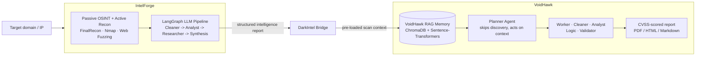

# DarkIntel

**Unified AI-powered penetration-testing pipeline** — chains **[IntelForge](https://github.com/WaelHammali/IntelForge)** (passive OSINT + active recon) directly into **[VoidHawk](https://github.com/WaelHammali/VoidHawk)** (6-agent LangGraph validation & exploit reasoning), producing CVSS-scored vulnerability reports from a single command.

> Built during an engineering internship at **Keystone Groupe** (Jun–Jul 2026), connecting two independently developed frameworks into one end-to-end workflow.

---

## How it fits together

**The bridge's job:** take IntelForge's structured JSON report and inject it into VoidHawk's ChromaDB-backed memory *before* a run starts, so VoidHawk's Planner agent never has to re-discover what IntelForge already found — it goes straight to validation, exploit reasoning and severity ranking.

## Why two frameworks instead of one

- **IntelForge** is optimized for breadth: parallel recon collectors, a deterministic LangGraph pipeline, fast time-to-signal.
- **VoidHawk** is optimized for depth: a slower, multi-agent reasoning loop (Planner/Worker/Validator) with persistent memory across sessions.

Keeping them separate lets each evolve independently; DarkIntel is the integration layer, not a rewrite of either.

## Stack

`Python` · `LangGraph` · `LangChain` · `Ollama` · `ChromaDB` · `Sentence-Transformers` · `SQLite`

## Status

🚧 In development — the bridge logic (report → RAG memory ingestion) is being built. See [IntelForge](https://github.com/WaelHammali/IntelForge) and [VoidHawk](https://github.com/WaelHammali/VoidHawk) for the two frameworks it connects.

## License

MIT — see [LICENSE](LICENSE).
