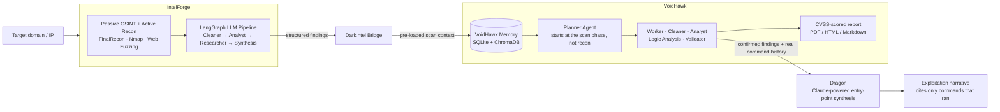

<div align="center">

# DarkIntel

**The bridge between recon and reasoning.**

Connects **[IntelForge](https://github.com/WaelHammali/IntelForge)** (OSINT + active recon) into
**[VoidHawk](https://github.com/WaelHammali/VoidHawk)** (6-agent LangGraph validation & exploit
reasoning), then hands VoidHawk's *confirmed* findings to **Dragon** — a Claude-powered stage that
writes the exploitation narrative, citing only commands that were actually run.

[](LICENSE)
[](https://www.python.org/downloads/)
[](https://langchain-ai.github.io/langgraph/)


> Built during an engineering internship at **Keystone Groupe** (Jun–Jul 2026), connecting two
> independently developed frameworks into one end-to-end workflow.

⚠️ **For authorized security testing and educational use only.** You are responsible for
obtaining explicit written permission before testing any system.

</div>

---

## 📖 Table of Contents

- [How It Works](#️-how-it-works)
- [Why Two Frameworks Instead of One](#-why-two-frameworks-instead-of-one)
- [What DarkIntel Does *Not* Do](#-what-darkintel-does-not-do)
- [Install](#-install)
- [Configuration](#️-configuration)
- [Usage](#️-usage)
- [Project Layout](#-project-layout)
- [Development](#-development)
- [Legal Disclaimer](#-legal-disclaimer)
- [License](#-license)

---

## ⚙️ How It Works



Three stages, each owning exactly one job:

1. **IntelForge scouts.** Passive OSINT and active recon against the target — open ports,
   services, subdomains, directories, candidate exploit vectors.
2. **VoidHawk validates.** The bridge writes IntelForge's findings into VoidHawk's own memory
   (`MemoryAgent`) and starts its graph at the **scan** phase — recon tools are removed from its
   toolbox entirely, so it structurally cannot repeat work IntelForge already did. VoidHawk's own
   Planner/Worker/Analyst/Validator loop takes it from there and produces its usual CVSS-scored
   report.
3. **Dragon synthesizes.** Once VoidHawk has *confirmed* which findings are real, Dragon (opt-in,
   Claude-powered) reads only the confirmed findings and the literal commands that were run, and
   writes one ordered narrative: the entry point, the steps, and the exact command backing each
   one. It never invents a command, a CVE, or a finding that isn't in the evidence.

## 🤔 Why Two Frameworks Instead of One

| | IntelForge | VoidHawk |
|---|---|---|
| Optimized for | **Breadth** — parallel recon collectors, deterministic pipeline, fast time-to-signal | **Depth** — a slower multi-agent reasoning loop with persistent memory across sessions |
| Tool count | 3 collectors (Nmap, FinalRecon, web fuzzing) | 23 security tools |
| Validation | Synthesis only (asserts its own findings) | Independent LLM Validator (confirms/rejects, assigns CVSS) |

Keeping them separate lets each evolve on its own — DarkIntel is the integration layer, **not a
rewrite of either**. It doesn't vendor or duplicate a single line of either project; it only
converts one side's output into the other's input.

## 🚫 What DarkIntel Does *Not* Do

- It does not modify IntelForge or VoidHawk — both are installed as ordinary dependencies,
  unmodified, straight from their own repos.
- It does not re-implement validation or CVSS scoring — that's VoidHawk's Validator, used as-is.
- Dragon does not run new commands on its own initiative. It reasons over evidence that already
  exists (VoidHawk's confirmed findings, the real command history) and never fabricates a command,
  CVE, or finding that isn't backed by that evidence.

## 🚀 Install

Requires **Python 3.11–3.13**, and whichever of VoidHawk's security tools you want available
(`nmap` at minimum) on your `PATH`.

```bash
git clone git@github.com:WaelHammali/DarkIntel.git
cd DarkIntel
python3 -m venv .venv && source .venv/bin/activate
pip install -e ".[dev]"     # also pulls IntelForge and VoidHawk straight from GitHub

cp .env.example .env        # then fill in at least GROQ_API_KEY
```

## ⚙️ Configuration

DarkIntel runs both frameworks in-process from one working directory, so a single `.env` there
configures all three — no prefix collisions:

| Prefix | Owner | Example |
|---|---|---|
| `INTELFORGE_*` | IntelForge's own settings | `INTELFORGE_LLM_ANALYST="groq:llama-3.3-70b-versatile"` |
| *(none)* | VoidHawk's own settings | `VALIDATOR_CONFIDENCE_THRESHOLD=70`, `MEMORY_VECTOR_ENABLED=true` |
| `DARKINTEL_*` | Dragon | `DARKINTEL_LLM_DRAGON="anthropic:claude-opus-4-..."` |

See [`.env.example`](.env.example) for the full reference. `GROQ_API_KEY` alone is enough to run
the whole bridge (IntelForge + VoidHawk both default to Groq). Dragon is **opt-in** — leave
`DARKINTEL_LLM_DRAGON` unset and that stage is skipped cleanly, no error.

## ▶️ Usage

**Interactive console** — bare `darkintel` launches a prompt with one command, `burn`:

```bash
darkintel
```
```
DarkIntel — IntelForge recon -> VoidHawk validation -> Dragon.
Type help for commands, exit to leave.

DRAgon > burn 10.10.10.5
DRAgon > burn https://target.com all
```

**Scriptable** — `darkintel run` does the same thing non-interactively:

```bash
darkintel run <authorized-target> --report-format pdf   # or html | markdown | all
```

Either way, a run does exactly what the diagram above shows: IntelForge recon → VoidHawk
validation (starting at the scan phase) → VoidHawk's own report → Dragon's entry-point narrative,
printing progress live at every stage.

## 📁 Project Layout

```
src/darkintel/
├── bridge.py           # the bridge itself: recon -> seed VoidHawk's memory -> run -> Dragon
├── dragon.py           # Claude-powered synthesis over VoidHawk's confirmed findings
├── cli.py              # `darkintel run` + bare-command console launch
├── console.py          # the interactive "DRAgon >" REPL (`burn <target>`)
├── output.py           # shared result rendering (cli.py + console.py)
├── config.py           # Dragon's settings (DARKINTEL_* env vars)
├── llm.py              # provider-agnostic chat-model factory for Dragon
├── _json.py            # strips LLM markdown fences/reasoning noise before json.loads
└── prompts/dragon.txt  # Dragon's system prompt — the evidence-discipline rules it must follow
tests/                  # pytest, FakeListChatModel — no live scans or LLM calls
```

## 🛠️ Development

```bash
ruff check src tests && ruff format --check src tests
mypy src
pytest -q
```

## ⚖️ Legal Disclaimer

**DarkIntel — and the frameworks it connects — are designed exclusively for authorized security
testing and educational purposes.**

- ✅ **Legal use:** Authorized penetration testing, security research, CTF competitions,
  educational labs.
- ❌ **Illegal use:** Unauthorized access, malicious activity, attacking systems without explicit
  permission.

Unauthorized access to computer systems is illegal under the Computer Fraud and Abuse Act (CFAA),
GDPR, and equivalent international legislation. You are fully responsible for ensuring you have
explicit written permission before testing any system. By using DarkIntel, you agree to these
terms — the developers assume **zero liability** for misuse.

## 📄 License

MIT — see [LICENSE](LICENSE).
