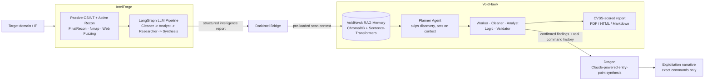

# DarkIntel

**Unified AI-powered penetration-testing pipeline** — chains **[IntelForge](https://github.com/WaelHammali/IntelForge)** (passive OSINT + active recon) directly into **[VoidHawk](https://github.com/WaelHammali/VoidHawk)** (6-agent LangGraph validation & exploit reasoning), producing CVSS-scored vulnerability reports from a single command.

> Built during an engineering internship at **Keystone Groupe** (Jun–Jul 2026), connecting two independently developed frameworks into one end-to-end workflow.

---

## How it fits together



**The bridge's job:** take IntelForge's structured JSON report and inject it into VoidHawk's ChromaDB-backed memory *before* a run starts, so VoidHawk's Planner agent never has to re-discover what IntelForge already found — it goes straight to validation, exploit reasoning and severity ranking. Once VoidHawk's own Validator has confirmed which findings are real, **Dragon** (opt-in, Claude-powered) chains only the *confirmed* ones into a single ordered path to a foothold, citing only commands that were actually run — no new validation logic, just synthesis over trusted evidence.

## Why two frameworks instead of one

- **IntelForge** is optimized for breadth: parallel recon collectors, a deterministic LangGraph pipeline, fast time-to-signal.
- **VoidHawk** is optimized for depth: a slower, multi-agent reasoning loop (Planner/Worker/Validator) with persistent memory across sessions.

Keeping them separate lets each evolve independently; DarkIntel is the integration layer, not a rewrite of either.

## Stack

`Python` · `LangGraph` · `LangChain` · `Ollama` · `ChromaDB` · `Sentence-Transformers` · `SQLite`

## Usage

```bash
git clone git@github.com:WaelHammali/DarkIntel.git
cd DarkIntel
python3 -m venv .venv && source .venv/bin/activate
pip install -e ".[dev]"   # also pulls IntelForge and VoidHawk from GitHub

darkintel run <authorized-target> --report-format pdf
```

This runs IntelForge's recon, seeds the findings into VoidHawk's memory, lets VoidHawk's own
Planner/Validator/reporting run starting at the scan phase (recon is skipped — IntelForge already
did it), then hands VoidHawk's *confirmed* findings to **Dragon**: a Claude-powered stage that
chains them into a concrete entry-point narrative, citing only commands that were actually run.
Dragon is opt-in — set `DARKINTEL_LLM_DRAGON` (e.g. `anthropic:claude-opus-4-...`) and
`ANTHROPIC_API_KEY` in `.env`, otherwise that stage is skipped cleanly.

Neither IntelForge nor VoidHawk is modified — `darkintel` only depends on both and converts one
side's output into the other's input.

## Status

✅ The bridge is implemented: `src/darkintel/bridge.py` (recon → memory → VoidHawk run) and
`src/darkintel/dragon.py` (confirmed findings → entry-point narrative). See
[IntelForge](https://github.com/WaelHammali/IntelForge) and
[VoidHawk](https://github.com/WaelHammali/VoidHawk) for the two frameworks it connects.

## License

MIT — see [LICENSE](LICENSE).
